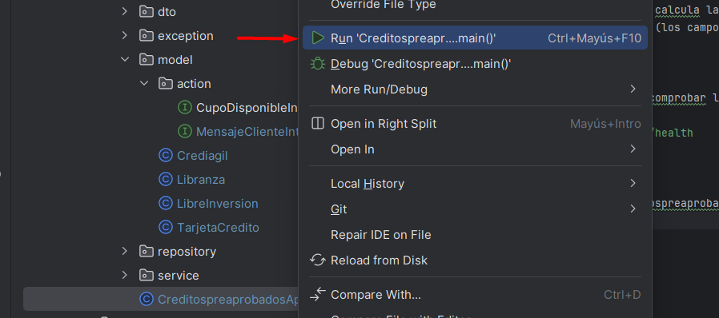

# Contexto de la aplicación

La siguiente aplicación es para listar que preaprobados de créditos hay disponibles con fecha de vencimiento, cupo disponible y a quien está asociado. La estructura cuanta con 4 entidades: Libranza, Crediagil, Libre Inversion y Tarjeta de crédito.

## Campos
Cada entidad tiene campos similares a los siguientes:
- Cedula: Identificacion de la persona con el preaprobado
- Cupo: Cupo aprobado
- Consumido: Cuanto se ha consumido
- Fecha de Vencimiento: Hasta cuando la persona tiene el preaprobado disponible

## Interfaces
- MensajeClienteInterface: Se debe proporcionar un texto para los clientes, según el tipo de crédito.
- CupoDisponibleInterface: Se debe calcular la diferencia entre el total aprobodado por el total consumido (los campos varian en el nombramiento de los mismos).

## Salud de la aplicación
Con la siguiente API se procede a comprobar la salud de la aplicación -> [Health](http://localhost:8080/api/actuator/health)
```
http://localhost:8080/api/actuator/health
```

## Ejecución del proyecto
Basta con ejecutar la clase CreditospreaprobadosApplication


## Endpoints
Todos los endpoints se pueden verificar y ejecutar entrando al siguiente enlace luego de ejecutar el proyecto

[Swagger-UI](http://localhost:8080/api/swagger-ui.html)

**NOTA**: El controlador Libranza contiene todos los métodos que conforman un CRUD
